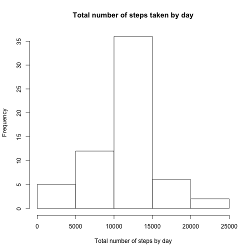
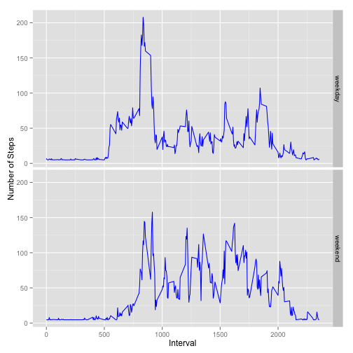

#Reproducible Research, Project 1  
###Tobias Crabtree
###Coursera, August 2014
========================================================

##Loading and preprocessing the data in R
Personal movement activity data was downloaded August 2014 from 
https://d396qusza40orc.cloudfront.net/repdata%2Fdata%2Factivity.zip

The variables included in this dataset are:
- steps: Number of steps taking in a 5-minute interval (missing values are coded as NA)
- date: The date on which the measurement was taken in YYYY-MM-DD format
- interval: Identifier for the 5-minute interval in which measurement was taken

The dataset is stored in a comma-separated-value (CSV) file and there are a total of 17,568 observations in this dataset.

Transformations to the data include:
- Changed class to dates
- Removed missing data (i.e., steps has 2304 NA's)


```r
require(knitr)
data <- read.csv("activity.csv") #read data 
summary(data) # review data
```

```
##      steps               date          interval   
##  Min.   :  0.0   2012-10-01:  288   Min.   :   0  
##  1st Qu.:  0.0   2012-10-02:  288   1st Qu.: 589  
##  Median :  0.0   2012-10-03:  288   Median :1178  
##  Mean   : 37.4   2012-10-04:  288   Mean   :1178  
##  3rd Qu.: 12.0   2012-10-05:  288   3rd Qu.:1766  
##  Max.   :806.0   2012-10-06:  288   Max.   :2355  
##  NA's   :2304    (Other)   :15840
```

```r
data$date <- as.Date(data$date,"%Y-%m-%d") # transform dates
data <- na.omit(data) # remove missing data 
```

## What is the mean total number of steps taken per day?

```r
require(plyr) # load required plyr package
```

```
## Loading required package: plyr
```

```r
dataSum <- ddply(data, .(date), summarize, total=sum(steps))
hist(dataSum$total, main="Total number of steps taken by day", 
     xlab="Total number of steps by day", col="white", bg="white")
```

 

```r
mean(dataSum$total)
```

```
## [1] 10766
```

```r
median(dataSum$total)
```

```
## [1] 10765
```

## What is the average daily activity pattern?

```r
require(plyr) # load required plyr package
dataMeanInt <- ddply(data, .(interval), summarize, mean=mean(steps)) # calculate mean steps by day
plot(dataMeanInt$interval, dataMeanInt$mean, type="l", main="Average Daily Activity Pattern", 
     xlab="5 minute interval", ylab="Avg. # of Steps", bg="white")
```

 

```r
dataMeanInt2 <- ddply(data, .(interval, steps), summarize, mean=mean(steps)) # calculate mean steps by day
max <- max(dataMeanInt2$steps) # determine max steps
df <- dataMeanInt2[dataMeanInt2$steps==max,] # create dataframe with max steps and interval
df$interval ## returns 5 minute interval with the max amount of steps
```

```
## [1] 615
```


## Inputting missing values

```r
data2 <- read.csv("activity.csv") #re-read data as previously removed missing values
sum(is.na(data2)) # returns #'s of missing values
```

```
## [1] 2304
```

```r
# fill in missing values with mean # of steps and create a new dataset
data2$steps[is.na(data2$steps)] <- mean(data2$steps, na.rm=TRUE)

# create a histogram
data2Sum <- ddply(data2, .(date), summarize, total=sum(steps))
hist(data2Sum$total, main="Total number of steps taken by day", 
     xlab="Total number of steps by day", col="white", bg="white")
```

 

```r
mean(data2Sum$total)
```

```
## [1] 10766
```

```r
median(data2Sum$total)
```

```
## [1] 10766
```
By inputting missing values the mean and median now converge to be the same #.

## Are there differences in activity patterns between weekdays and weekends?

```r
require(ggplot2)
```

```
## Loading required package: ggplot2
```

```r
data2$date <- as.Date(data2$date,"%Y-%m-%d") # transform dates
data2$day <- as.factor(weekdays(data2$date)) # add day of week to data set
data2$weekend <- NA # add column for weekend
data2$steps[is.na(data2$steps)] <- mean(data2$steps, na.rm=TRUE) # fill in missing values
# loop through data set adding a column for weekend or weekday
for (i in 1:nrow(data2)) {
        if (data2[i,]$day %in% c("Saturday","Sunday")) {
        data2[i,]$weekend<-"weekend"
} else{
        data2[i,]$weekend<-"weekday"
}
}
data2weekend <- ddply(data2, .(interval, weekend), summarize, mean=mean(steps)) # calculate mean steps by day
ggplot(data2weekend, aes(interval, mean)) + geom_line(color="blue") + 
        facet_grid(weekend~.) +
        labs(x="Interval", y="Number of Steps")
```

 

