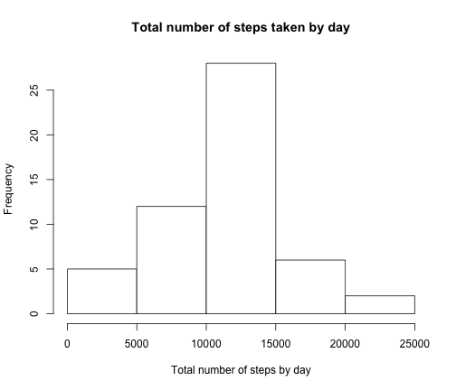

#Reproducible Research, Project 1  
#Tobias Crabtree
#Coursera, August 2014
========================================================

##Loading and preprocessing the data in R
Personal movement activity data was downloaded August 2014 from 
https://d396qusza40orc.cloudfront.net/repdata%2Fdata%2Factivity.zip

The variables included in this dataset are:

- steps: Number of steps taking in a 5-minute interval (missing values are coded as NA)
- date: The date on which the measurement was taken in YYYY-MM-DD format
- interval: Identifier for the 5-minute interval in which measurement was taken

The dataset is stored in a comma-separated-value (CSV) file and there are a total of 17,568 observations in this dataset.

Transformations to the data include:
- Changed class to dates
- Removed missing data (i.e., steps has 2304 NA's)


```r
require(knitr)
data <- read.csv("activity.csv") #read data 
summary(data) # review data
```

```
##      steps               date          interval   
##  Min.   :  0.0   2012-10-01:  288   Min.   :   0  
##  1st Qu.:  0.0   2012-10-02:  288   1st Qu.: 589  
##  Median :  0.0   2012-10-03:  288   Median :1178  
##  Mean   : 37.4   2012-10-04:  288   Mean   :1178  
##  3rd Qu.: 12.0   2012-10-05:  288   3rd Qu.:1766  
##  Max.   :806.0   2012-10-06:  288   Max.   :2355  
##  NA's   :2304    (Other)   :15840
```

```r
data$date <- as.Date(data$date,"%Y-%m-%d") # transform dates
data <- na.omit(data) # remove missing data 
```

## What is the mean total number of steps taken per day?


```r
require(plyr) # load required plyr package
```

```
## Loading required package: plyr
```

```r
dataSum <- ddply(data, .(date), summarize, total=sum(steps))
hist(dataSum$total, main="Total number of steps taken by day", xlab="Total number of steps by day")
```

 

```r
dataMean <- ddply(data, .(date), summarize, mean=mean(steps)) # calculate mean steps by day
dataMedian <- ddply(data, .(date), summarize, median=median(steps)) # calculate mean steps by day
dataMean
```

```
##          date    mean
## 1  2012-10-02  0.4375
## 2  2012-10-03 39.4167
## 3  2012-10-04 42.0694
## 4  2012-10-05 46.1597
## 5  2012-10-06 53.5417
## 6  2012-10-07 38.2465
## 7  2012-10-09 44.4826
## 8  2012-10-10 34.3750
## 9  2012-10-11 35.7778
## 10 2012-10-12 60.3542
## 11 2012-10-13 43.1458
## 12 2012-10-14 52.4236
## 13 2012-10-15 35.2049
## 14 2012-10-16 52.3750
## 15 2012-10-17 46.7083
## 16 2012-10-18 34.9167
## 17 2012-10-19 41.0729
## 18 2012-10-20 36.0938
## 19 2012-10-21 30.6285
## 20 2012-10-22 46.7361
## 21 2012-10-23 30.9653
## 22 2012-10-24 29.0104
## 23 2012-10-25  8.6528
## 24 2012-10-26 23.5347
## 25 2012-10-27 35.1354
## 26 2012-10-28 39.7847
## 27 2012-10-29 17.4236
## 28 2012-10-30 34.0938
## 29 2012-10-31 53.5208
## 30 2012-11-02 36.8056
## 31 2012-11-03 36.7049
## 32 2012-11-05 36.2465
## 33 2012-11-06 28.9375
## 34 2012-11-07 44.7326
## 35 2012-11-08 11.1771
## 36 2012-11-11 43.7778
## 37 2012-11-12 37.3785
## 38 2012-11-13 25.4722
## 39 2012-11-15  0.1424
## 40 2012-11-16 18.8924
## 41 2012-11-17 49.7882
## 42 2012-11-18 52.4653
## 43 2012-11-19 30.6979
## 44 2012-11-20 15.5278
## 45 2012-11-21 44.3993
## 46 2012-11-22 70.9271
## 47 2012-11-23 73.5903
## 48 2012-11-24 50.2708
## 49 2012-11-25 41.0903
## 50 2012-11-26 38.7569
## 51 2012-11-27 47.3819
## 52 2012-11-28 35.3576
## 53 2012-11-29 24.4688
```

```r
dataMedian
```

```
##          date median
## 1  2012-10-02      0
## 2  2012-10-03      0
## 3  2012-10-04      0
## 4  2012-10-05      0
## 5  2012-10-06      0
## 6  2012-10-07      0
## 7  2012-10-09      0
## 8  2012-10-10      0
## 9  2012-10-11      0
## 10 2012-10-12      0
## 11 2012-10-13      0
## 12 2012-10-14      0
## 13 2012-10-15      0
## 14 2012-10-16      0
## 15 2012-10-17      0
## 16 2012-10-18      0
## 17 2012-10-19      0
## 18 2012-10-20      0
## 19 2012-10-21      0
## 20 2012-10-22      0
## 21 2012-10-23      0
## 22 2012-10-24      0
## 23 2012-10-25      0
## 24 2012-10-26      0
## 25 2012-10-27      0
## 26 2012-10-28      0
## 27 2012-10-29      0
## 28 2012-10-30      0
## 29 2012-10-31      0
## 30 2012-11-02      0
## 31 2012-11-03      0
## 32 2012-11-05      0
## 33 2012-11-06      0
## 34 2012-11-07      0
## 35 2012-11-08      0
## 36 2012-11-11      0
## 37 2012-11-12      0
## 38 2012-11-13      0
## 39 2012-11-15      0
## 40 2012-11-16      0
## 41 2012-11-17      0
## 42 2012-11-18      0
## 43 2012-11-19      0
## 44 2012-11-20      0
## 45 2012-11-21      0
## 46 2012-11-22      0
## 47 2012-11-23      0
## 48 2012-11-24      0
## 49 2012-11-25      0
## 50 2012-11-26      0
## 51 2012-11-27      0
## 52 2012-11-28      0
## 53 2012-11-29      0
```


